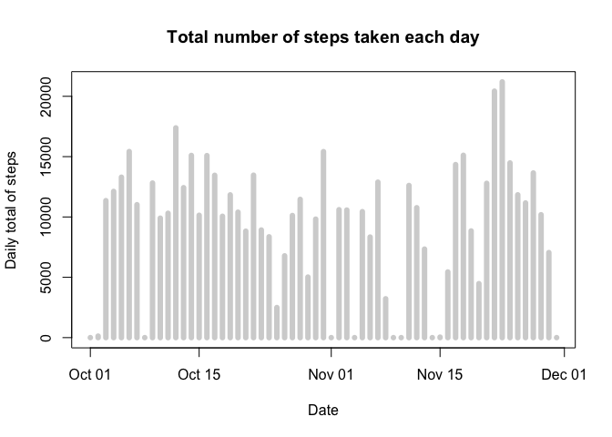
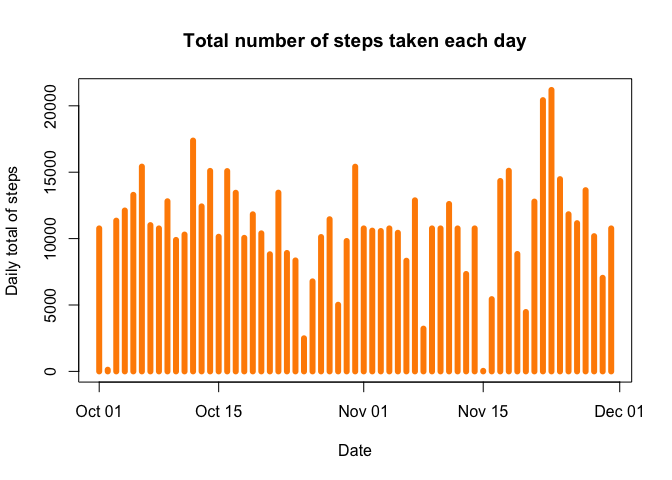

# Reproducible Research: Peer Assessment 1


## Loading and preprocessing the data

The first step is to load the data from the working directory and to transform the class of the date variable into the date format.

```r
setwd("~/Dropbox/Data_Science/Reproducible_Research_Assignment_1/RepData_PeerAssessment1")
activity <- read.csv("activity.csv")
activity$date <- as.Date(activity$date, "%Y-%m-%d")
```

## What is mean total number of steps taken per day?
For the second step, we use dplyr to group the data by the day, and find the total number of steps for each day (removing the NA's). The total for each day is represented in the following histogram:


```r
library(dplyr)
```

```
## 
## Attaching package: 'dplyr'
```

```
## The following objects are masked from 'package:stats':
## 
##     filter, lag
```

```
## The following objects are masked from 'package:base':
## 
##     intersect, setdiff, setequal, union
```

```r
activity_byday <- group_by(activity, date)
total_steps <- summarise(activity_byday, total = sum(steps, na.rm=TRUE))
plot(total_steps$date, total_steps$total, type = "h", main = "Total number of steps taken each day", ylab = "Daily total of steps", xlab = "Date", lwd = 6, col = "lightgrey")
```

<!-- -->

The following code calculates the summary statistics for the data set.


```r
data_summary <- summary(total_steps)
mean_s <- data_summary[4,2]
median_s <- data_summary[3,2]
```

The mean value for total steps taken per day is Mean   : 9354  , and the median value for total steps taken per day is Median :10395  .

## What is the average daily activity pattern?
First, we use dplyr to group the activity data by 5-minute interval, calculate the mean for each interval, across all days, and then plot the values in a time series plot.


```r
activity_byinterval <- group_by(activity, interval)
mean_steps_interval <- summarise(activity_byinterval, mean_steps = mean(steps, na.rm = TRUE))
plot(mean_steps_interval$interval, mean_steps_interval$mean_steps, type = "l", xlab = "Five-minute interval", ylab = "Average number of steps", main = "Average number of steps for every five-minute interval")
```

<!-- -->

The following code finds the interval with the highest average number of steps. 

```r
index_max <- which.max(mean_steps_interval$mean_steps)
max_average_steps <- mean_steps_interval[index_max,]
```

The 5-minute interval with the highest average number of steps is the interval starting with minute 835. The average value for that interval is 206.1698113.

## Imputing missing values

First, we find the total number of missing values for the dataset.


```r
missing <- is.na(activity$steps)
sum(missing)
```

```
## [1] 2304
```
The total number of rows with missing values is 2304.

Second, we impute missing values by taking the mean value for the missing five-minute interval (using the data already calculated above) and replacing NA with that mean value.


```r
new_activity <- activity
for (i in 1:nrow(new_activity)){
        if (is.na(new_activity[i,]$steps)){
                new_activity[i,]$steps <- 
                        mean_steps_interval[mean_steps_interval$interval
                        == new_activity[i,]$interval,]$mean_steps
        }
}
```

We can confirm whether there are any missing values left.


```r
nas <- sum(is.na(new_activity$steps))
```

The number of missing values in the new dataset is 0.

We now make a histogram of new dataset, calculating the total number of steps for each day.


```r
new_activity_byday <- group_by(new_activity, date)
new_total_steps <- summarise(new_activity_byday, total = sum(steps, na.rm=TRUE))
plot(new_total_steps$date, new_total_steps$total, type = "h", main = "Total number of steps taken each day", ylab = "Daily total of steps", xlab = "Date", lwd = 6, col = "darkorange")
```

<!-- -->

We now calculate the mean and median of the total number of steps per day for the new dataset.


```r
new_data_summary <- summary(new_total_steps)
new_mean_s <- new_data_summary[4,2]
new_median_s <- new_data_summary[3,2]
```

The mean value of steps before imputing the missing values was Mean   : 9354  , and after imputing the missing values this value has changed to Mean   :10766  . 
The median value of steps before imputing the missing values was Median :10395  , and after imputing the missing values this value has changed to Median :10766  . 
The mean and median values differ from the original values, they are higher on both counts. The new median and mean values are also identical.

## Are there differences in activity patterns between weekdays and weekends?

First, we create a new factor variable for the new dataset, with two levels indicating whether the day of the measurement was a weekday or a weekend.


```r
weekday <- weekdays(new_activity$date)
weekday_logical <- weekday == "Saturday"| weekday =="Sunday"
weekday_factor <- factor(weekday_logical, labels = c("Weekday", "Weekend"))
new_activity_2 <- cbind(new_activity, weekday_factor)
```

Now group the dataset by interval and whether the measurement was taken on a weekend or weekday, and plot the average number of steps for each 5-minute interval (across all days) for both datasets within a two-panel plot.


```r
##weekday_data <- subset(new_activity_2, new_activity_2$weekday_factor == "Weekday")
##weekend_data <- subset(new_activity_2, new_activity_2$weekday_factor == "Weekend")
library(lattice)
weekday_grouped <- group_by(new_activity_2, interval, weekday_factor)
weekday_means <- summarise(weekday_grouped, mean_steps = mean(steps))
graph <- xyplot(mean_steps ~ interval | weekday_factor, 
                data=weekday_means,
                type = "l",
                layout = c(1,2),
                main = "Average number of steps for each interval", 
                xlab = "Five-Minute interval",
                ylab = "Average number of steps"
                )
graph
```

<!-- -->

